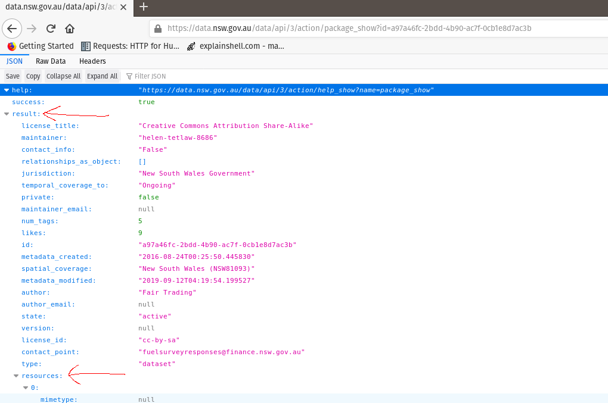
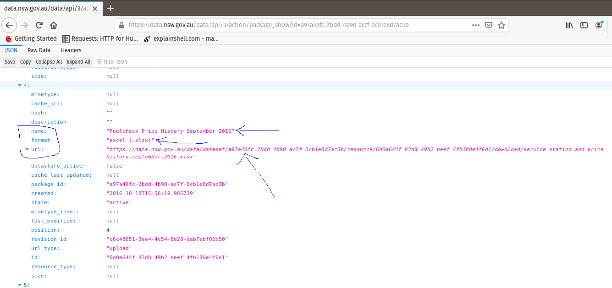
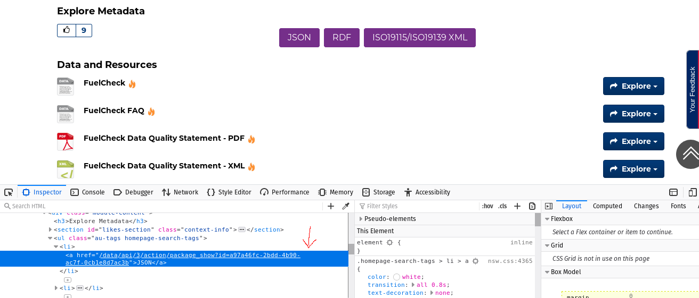
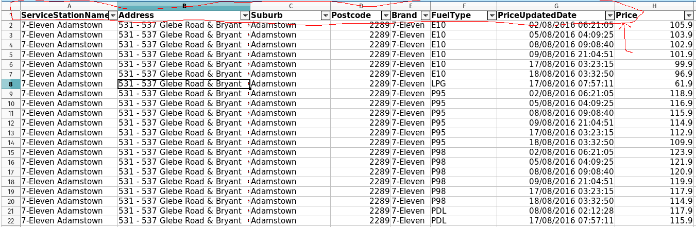

Extract, Transform and Load Data using R
================
Samuel Oranyeli

This is a tutorial that shows how to extract data from the web, tidy the
data and load it into a database. Let’s outline our goals : <br> 1.
Extract datasets of historical fuel prices from the New South Wales Fuel
Check website - <https://data.nsw.gov.au/data/dataset/fuel-check>. <br>
2. Tidy the data sets so each column represents a row and each row
represents an observation.<br> 3. Transfer the datasets to a database
for storage.<br><br> all the code will be written in R. Installation
guide can be obtained here: Rstudio -
<https://rstudio.com/products/rstudio/download/> <br> R -
<https://cloud.r-project.org> <br>

## Data Extraction

This is also known as web scraping - you are pulling data from some
website on the internet. It is advisable that you check the website’s
terms and conditions, and see if they allow web scraping. <br>For this
project however, it is publicly available data, so no danger of breaking
the law. <br> First, let’s see what the home page of the website looks
like:<br><br>  <br><br>This is a snippet of the home
page, and has fuel prices for all the fuel stations in New South Wales
listed. We can go ahead and download for each month, by clicking on each
file; however, there is a better way to automate the process. You see
the JSON link there? Yep, that JSON link, the one with the circle around
it, and an arrow. It contains the urls for all the files. All we have to
do is find a way to download the JSON file, extract the urls, and
download all the files. Let’s outline that:<br><br> 1. Download the JSON
file. <br> 2. Extract the urls from the JSON file. <br> 3. Download all
the datasets using the urls. <br><br>

Now, how do we get the JSON file? Before we do that, let’s look at the
JSON file, and be sure it has what we want. Click on the JSON link; it
should show you something similar to this:<br><br>
<br><br> 

Quick Note: JSON (Javascript Object Notation) is a lightweight format
for storing and transporting data over the web. You can read more about
it here: <https://www.w3schools.com/whatis/whatis_json.asp>.

From the image above, we observe that our required urls are nested in
the resources tab, which is nested in the results tab. At least, we can
confirm that our JSON file is there. <br> Note that we could easily have
downloaded the file and gotten our data, without going through the data
scraping exercise. However, it is much better to automate the process,
such that you can capture more datasets as they are added, without
having to manually download a new JSON file.<br><br> Alrighty, we have
confirmed that our JSON file holds all the urls we need. How do we get
it? A little primer here before we proceed - <br> Web pages are written
in HTML, a markup language, and CSS, which describes how the HTML
elements are to be displayed. You can read more about it here :
<https://www.w3schools.com/whatis/whatis_css.asp> <br> To get our data,
we need to know where it is located on the page - which element holds
the JSON file. We can find that out by right clicking the JSON link and
selecting Inspect Element. You should have a screen similar to this:
<br>  <br><br> Notice where the arrow is pointing to?
That is where the JSON element is located. Look closely, and you will
see that the JSON link is within an href attribute (href in HTML
represent the links that take us from one page to another page or to
another location on the same page). The href attribute is located in the
first a tag of the li (list item) tag, which is located in a ul
(unordered list) tag with a class “au-tags homepage-search-tags”. So, to
get to our JSON file, we need to first get to the ul selector, extract
the a tags in the list items, then pull out the href link that has the
JSON. Seems convoluted at first, but the more you play with it, the more
it makes sense. You can also read more about HTML and CSS here :
<https://www.w3schools.com/> <br> So what’s the flow: Get the ul
selector, get the list items, pull out the first href, then we can get
the href link that houses the JSON file. <br><br> Alright, let’s code
(yeah, I know, but one of the keys of data science is understanding what
you want to do, and how to get your data before writing a line of code.
What’s the point of writing code if it has no aim or goal?)<br><br>
First we load the relevant packages - <br> 1. rvest to pick out the
elements containing the JSON file, <br> 2. roomba to get the urls from
the JSON file, <br> 3. stringr for string manipulation,<br> 4. dplyr for
data manipulation, and<br> 5. JSONlite to read the JSON file into
R.<br><br> Let’s outline the steps:<br> 1. Read in the url -
<https://data.nsw.gov.au/data/dataset/fuel-check> using rvest. <br> 2.
Look for the ul tag with the specific class. <br> 3. Look for the first
a tag in the ul tag. <br> 4. Look for the href attribute in the a tag.
<br> 5. ‘glue’ the extracted json url to
‘<https://data.nsw.gov.au>’.<br> 6. Pass the ‘glued’ url to JSONLite
to give us the actual JSON file.<br> 7. Pass the JSON file to roomba to
get a dataframe that contains all the names,urls, and formats in the
JSON file.<br> 8. Use dplyr to filter the dataframe for only the formats
that are xlsx, which is the format for the datasets.<br>

``` r
library(rvest)
library(dplyr)
library(jsonlite)
library(roomba)
library(stringr)

url <- 'https://data.nsw.gov.au/data/dataset/fuel-check'

json_content <- read_html(url)%>%
  html_nodes("ul.au-tags.homepage-search-tags")%>%
  html_nodes("a")%>%
  first()%>%
  html_attr("href")%>%
  str_glue("https://data.nsw.gov.au", .) %>%
  fromJSON(simplifyVector = FALSE) %>%
  roomba(cols = c("name","format","url"))%>%
  filter(str_detect(str_to_lower(format),"xlsx"))

json_content
```

    ## # A tibble: 39 x 3
    ##    name                   format     url                                   
    ##    <chr>                  <chr>      <chr>                                 
    ##  1 Fuelcheck Price Histo… excel (.x… https://data.nsw.gov.au/data/dataset/…
    ##  2 Fuelcheck Price Histo… excel (.x… https://data.nsw.gov.au/data/dataset/…
    ##  3 Fuelcheck Price Histo… excel (.x… https://data.nsw.gov.au/data/dataset/…
    ##  4 Fuelcheck Price Histo… excel (.x… https://data.nsw.gov.au/data/dataset/…
    ##  5 Fuelcheck Price Histo… XLSX       https://data.nsw.gov.au/data/dataset/…
    ##  6 Fuelcheck Price Histo… XLSX       https://data.nsw.gov.au/data/dataset/…
    ##  7 Fuelcheck Price Histo… XLSX       https://data.nsw.gov.au/data/dataset/…
    ##  8 Fuelcheck Price Histo… XLSX       https://data.nsw.gov.au/data/dataset/…
    ##  9 Fuelcheck Price Histo… XLSX       https://data.nsw.gov.au/data/dataset/…
    ## 10 Fuelcheck Price Histo… XLSX       https://data.nsw.gov.au/data/dataset/…
    ## # … with 29 more rows

<br> Let’s break down what’s going on in the code above:<br> 1. First we
assign the url to a variable called ‘url’<br> 2. We pass the url to an
rvest function called read\_html, which as the function name indicates,
reads in the html page.<br> 3. Now, our first goal is to look for the ul
tag with the class = “au-tags.homepage-search-tags”. We use the function
html\_nodes to look for the tag. Note how the ul and class are merged
into one name(‘ul.au-tags.homepage-search-tags’)<br> 4.We’ve found the
ul tag. Next stop is to get the a tags. Again, we use the html\_nodes
function.<br> 5.We want the first item, since that is where the JSON
link is housed. the first() function is used.<br> 6.Get the link out,
using the html\_attr function and passing the ‘href’ as argument.<br> 7.
join the names using str\_glue function to get a working url.<br> 8.
Pass the url to the fromJSON function of jsonlite. it will return a json
file.<br> 9. All we care about from the json file are the names, formats
and url entries. roomba gets that for us in a tibble.<br> 10. Finally,
we filter for only rows where the format contains “xlsx”.<br> <br> Quite
a number of steps, yeah, however, breaking a problem into chunks is a
very good way to solve a problem.<br> We have downloaded the JSON file
and extracted the urls; the last task is to download the actual datasets
of historical fuel prices in NSW.<br> \#\#\# To get the files, we need
to create a directory to house the files. Since our end point is a
database, we will make do with temporary files.<br> We will use the
identifiers from the json file names section to create the temporary
files. We will also be using the fs package to create the temporary
files.

``` r
library(fs)
library(glue)
library(purrr)

file_paths <- str_replace_all(json_content$name, " ","_") %>%
  str_remove_all(".xlsx")%>%
  map(., ~glue(.,'.xlsx'))

paths <- file_temp() %>%
  dir_create() %>%
  path(file_paths) %>%
  file_create()

paths
```

    ## /tmp/RtmpIKWjpu/file11381fcf08bb/Fuelcheck_Price_History_September_2016.xlsx
    ## /tmp/RtmpIKWjpu/file11381fcf08bb/Fuelcheck_Price_History_August_2016.xlsx
    ## /tmp/RtmpIKWjpu/file11381fcf08bb/Fuelcheck_Price_History_October_2016.xlsx
    ## /tmp/RtmpIKWjpu/file11381fcf08bb/Fuelcheck_Price_History_November_2016.xlsx
    ## /tmp/RtmpIKWjpu/file11381fcf08bb/Fuelcheck_Price_History_December_2016.xlsx
    ## /tmp/RtmpIKWjpu/file11381fcf08bb/Fuelcheck_Price_History_January_2017.xlsx
    ## /tmp/RtmpIKWjpu/file11381fcf08bb/Fuelcheck_Price_History_February_2017.xlsx
    ## /tmp/RtmpIKWjpu/file11381fcf08bb/Fuelcheck_Price_History_March_2017.xlsx
    ## /tmp/RtmpIKWjpu/file11381fcf08bb/Fuelcheck_Price_History_April_2017.xlsx
    ## /tmp/RtmpIKWjpu/file11381fcf08bb/Fuelcheck_Price_History_May_2017.xlsx
    ## /tmp/RtmpIKWjpu/file11381fcf08bb/Fuelcheck_Price_History_June_2017.xlsx
    ## /tmp/RtmpIKWjpu/file11381fcf08bb/Service_Station_&_price_History_July_2017.xlsx
    ## /tmp/RtmpIKWjpu/file11381fcf08bb/Service_Station_&_Price_History_August_2017.xlsx
    ## /tmp/RtmpIKWjpu/file11381fcf08bb/Service_Station_&_Price_History_October_2017.xlsx
    ## /tmp/RtmpIKWjpu/file11381fcf08bb/Service_Station_&_Price_History_September_2017.xlsx
    ## /tmp/RtmpIKWjpu/file11381fcf08bb/Service_Station_&_Price_History_November_2017.xlsx
    ## /tmp/RtmpIKWjpu/file11381fcf08bb/Service_Station_&_Price_History_December_2017.xlsx
    ## /tmp/RtmpIKWjpu/file11381fcf08bb/Service_Station_&_Price_History_January_2018.xlsx
    ## /tmp/RtmpIKWjpu/file11381fcf08bb/Service_Station_&_Price_History_February_2018.xlsx
    ## /tmp/RtmpIKWjpu/file11381fcf08bb/Service_Station_&_Price_History_March_2018.xlsx
    ## /tmp/RtmpIKWjpu/file11381fcf08bb/Service_Station_&_Price_History_April_2018.xlsx
    ## /tmp/RtmpIKWjpu/file11381fcf08bb/Service_Station_&_Price_History_May_2018.xlsx
    ## /tmp/RtmpIKWjpu/file11381fcf08bb/Service_Station_&_Price_History_June_2018.xlsx
    ## /tmp/RtmpIKWjpu/file11381fcf08bb/Service_Station_&_Price_History_July_2018.xlsx
    ## /tmp/RtmpIKWjpu/file11381fcf08bb/Service_Station_&_Price_History_August_2018.xlsx
    ## /tmp/RtmpIKWjpu/file11381fcf08bb/Service_Station_&_Price_History_September_2018.xlsx
    ## /tmp/RtmpIKWjpu/file11381fcf08bb/Service_Station_&_Price_History_October_2018.xlsx
    ## /tmp/RtmpIKWjpu/file11381fcf08bb/Fuelcheck_Price_History_November_2018.xlsx
    ## /tmp/RtmpIKWjpu/file11381fcf08bb/Fuelcheck_Price_History_Dec_2018.xlsx
    ## /tmp/RtmpIKWjpu/file11381fcf08bb/Fuelcheck_Price_History_January_2019.xlsx
    ## /tmp/RtmpIKWjpu/file11381fcf08bb/Service_Station_&_Price_History_Feb_2019.xlsx
    ## /tmp/RtmpIKWjpu/file11381fcf08bb/Service_Station_&_Price_History_Mar_2019.xlsx
    ## /tmp/RtmpIKWjpu/file11381fcf08bb/Service_Station_&_Price_History_Apr_2019.xlsx
    ## /tmp/RtmpIKWjpu/file11381fcf08bb/Service_Station_&_Price_History_May_2019.xlsx
    ## /tmp/RtmpIKWjpu/file11381fcf08bb/Service_Station_&_Price_History_Jun_2019.xlsx
    ## /tmp/RtmpIKWjpu/file11381fcf08bb/Service_Station_&_Price_History_Jul_2019.xlsx
    ## /tmp/RtmpIKWjpu/file11381fcf08bb/Service_Station_&_Price_History_Aug_2019.xlsx
    ## /tmp/RtmpIKWjpu/file11381fcf08bb/Service_Station_&_Price_History_Sep_2019.xlsx
    ## /tmp/RtmpIKWjpu/file11381fcf08bb/FuelCheck_Price_History_October_2019_.xlsx

Let’s break down what the code above does:<br> 1. we extract the column
name from json\_content, and replace empty spaces (" “) with”\_". <br>
2. Remove ‘.xlsx’ from any of the entries in 1. Not all entries have an
‘.xlsx’; let’s get rid of ‘em and start on a clean slate.<br> 3. Now
’glue’ back ‘.xlsx’ but to every single entry. Here, we use the map
function from the purrr library to achieve this.<br> 4. From here, we
create the file paths that will contain the excel files. First we create
names for the temporary files, which are passed on while creating a
single directory for them, then construct a relative path for each of
the file\_paths created in the previous code, and finally create the
temporary files. <br><br> Lots of steps just to download files, and we
are finally here:

``` r
library(httr)

#the purrr library plays an integral part here, allowing me to loop through the files in an easier way than with for loops.

#download the files, using the GET function from the httr library
downloads <- map(json_content$url, GET)%>%
  #read the content
  map(., content, as="raw") %>%
  #write the content into the files
  map2(.,paths,writeBin)
```




``` r
library(readxl)

#read in all the excel files using read_excel from the readxl library
#use the map function from purrr library
files_loaded <- map(paths, read_excel,
                    #not all the files have the col names at the very top. 
                    #So, I set the col_names to false, and fixed the headers later
                    #the screenshots above are examples of how the col header 
                    #locations are not uniform for all the files.
                    col_names = FALSE,
                    #set the column types as they were not too many columns really
                    col_types = c("text","text","text","numeric","text","text","date","numeric"),
                    #this is where I fixed the column names
                    .name_repair = ~ c("servicestationname","address",
                                       "suburb","postcode",
                                       "brand","fuelcode",
                                       "priceupdateddate","price"))

#attach file_names to each tibble
#for future identification
#and bind rows to form one tibble
#the map function from purrr library at work here too.
files_loaded <- files_loaded %>%
  map2_dfr(.x = files_loaded,
           .y = json_content$name,
           .f = ~ mutate(.x, file_header = .y))

files_loaded <- files_loaded %>%
  # this helps to remove any completely empty row(s)
  # and also rows that are not releveant to the data
  filter(!is.na(price))%>%
  fill(-price)%>%
  #remove duplicate rows
  distinct_at(vars("servicestationname","address","suburb","postcode","brand","fuelcode","priceupdateddate"))
```

Alrighty, last step is to move the files\_loaded dataframe to a
database.<br> I created a postgres database on my laptop and created a
table for the fuel prices.<br> We will use the DBI package to create a
connection to the database and copy the files\_loaded table to the
database

``` r
library(DBI)
library(config)

#get configuration details for database
dw <- config::get("datawarehouse")

#set connection to database
con <- dbConnect(RPostgres::Postgres(),
                 dbname = dw$database,
                 port = dw$port,
                 user = dw$uid,
                 password = dw$pwd)

#copy dataframe to fuel_prices_nsw table
dbWriteTable(con,"fuel_prices_nsw",files_loaded, append=TRUE)
```

And there you have it. In this tutorial, we saw how to scrape data from
the internet, download the files and save into a database. Hopefully, it
helps you in your next data science project.
